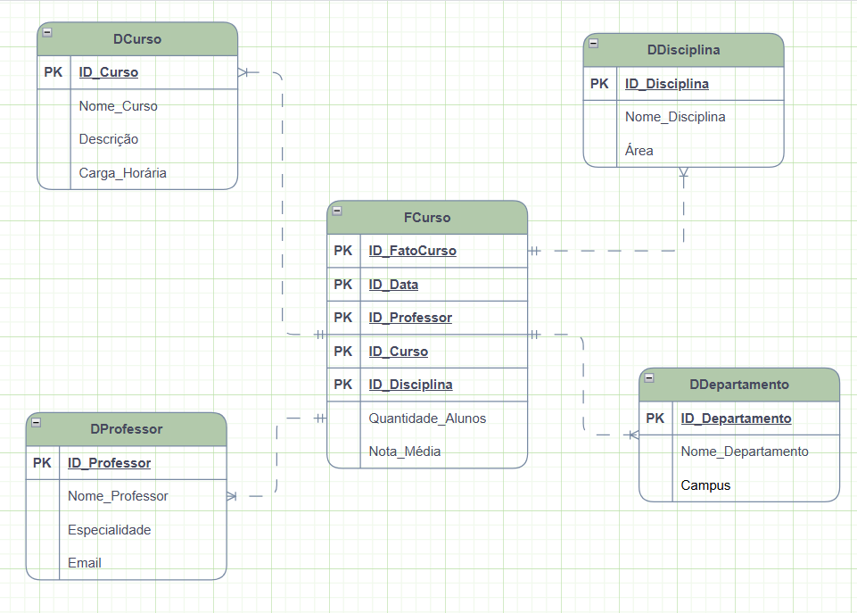

# Desafio de modelagem dimensional

## Star Schema

Fato: A tabela FatoCurso centraliza os dados principais para análise, incluindo o número de inscritos, a duração e o custo dos cursos.
Dimensões:
- Curso: Contém informações detalhadas sobre cada curso, como nome, descrição e categoria.
- Professor: Armazena dados sobre os professores palestrantes, incluindo nome, área de especialização e título acadêmico.
- Disciplina: Inclui informações sobre as disciplinas, como nome, descrição e departamento responsável.
- Data: Permite a análise temporal dos dados, com campos que abrangem diferentes níveis de granularidade, como ano, mês, dia, trimestre e semestre.

## Modelando um Star Schema com DAX
