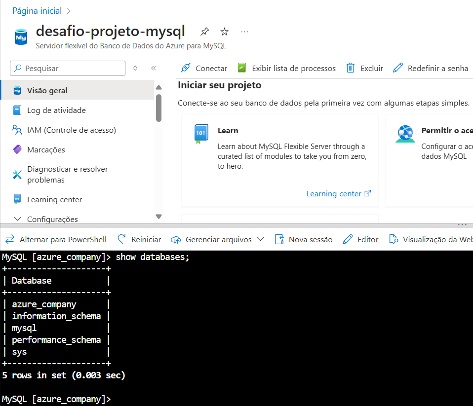

# Documentação do desafio – Processamento de Dados Simplificado com Power BI

## 1. Introdução

- Criação e inserção: Criei o banco de dados e tabelas no Portal Azure, para inserir os dados eu usei o comando `source inserts.sql`.
- Conexão Power BI: Conecte o Power BI ao MySQL e importe os dados.
- Transformação de dados: Use o Editor de Consultas no Power BI para verificar, transformar e limpar os dados.

## 2. Conexão com o Banco de Dados

## 3. Consultas SQL Utilizadas
Eu usei o arquivo disponibilizado pelo prof que está anexado na pasta também.
`script_bd_company.sql`
### 3.1 Inserção de Dados

Use o arquivo inserts.sql que está na pasta.